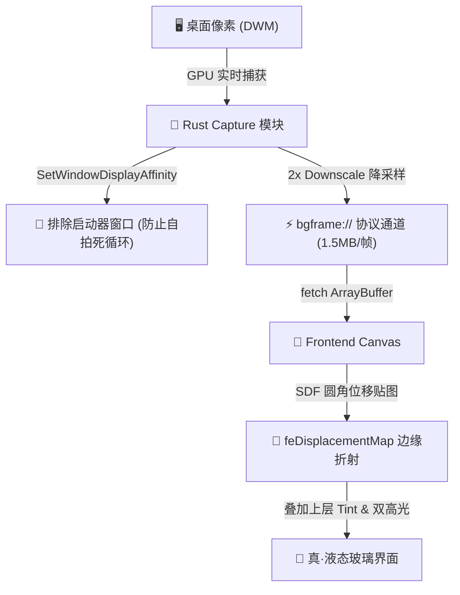

# 🧪 FromZero Launcher v0.2.2-preview

**FromZero Launcher v0.2.2-preview** 是我们专为 Windows 平台打造的“液态玻璃（Liquid Glass）”视觉效果的终极形态。我们在此版本中彻底突破了网页端透明窗口（WebView2）无法感知桌面背景像素的物理绝壁，将高频 Direct3D11 实时捕获管线引入底层，呈现出真正具有折射、扭曲与边缘色散透镜质感的活生生的“液态玻璃板”。

---

## 🎨 核心特性与优雅设计

### 1. 真·实时桌面折射 (Live Refractive Glass)
* **动态光影折射**：不同于前代死板的静态截图或平淡无奇的毛玻璃，当背景存在动态视频、拖动窗口或启动器本身位移时，折射画面会以 **60 FPS** 的速度与桌面同频呼吸。
* **自拍屏蔽机制**：后端在窗口创建时，注入 Win32 `SetWindowDisplayAffinity(hwnd, WDA_EXCLUDEFROMCAPTURE)`，使启动器在捕捉画面时对自己隐身，完美杜绝“镜中镜”无限自拍的套娃反馈环。

### 2. 精致微边框与防边缘破洞 (Border Protection)
* **外扩像素采样**：窗口维持在最紧凑的 `640x450` 物理尺寸（绝不拦截透明留白区域的点击事件），但内部 Canvas 使用 `top: -40px; left: -40px; width: 720px; height: 530px` 负外边距定位。
* **物理像素反光**：折射滤镜借此能够安全采样到窗口外侧的桌面背景像素，将高光、反光与位移折射带融合进边缘，根治了折射时“因边缘没有像素可采而露出空边/黑边”的视觉缺陷。

---

## 🏗️ 核心技术架构设计

### 极速数据重构与 60 FPS 追踪
* **Rust 级 2x 降采样**：高 DPI 下将裁剪的物理像素在 Rust 侧进行 2x 降采样（数据量由 6.1MB 压缩至 1.5MB）。在视觉上完全无损的前提下，将 IPC 传输与 CPU 拷贝性能开销降低了 4 倍！
* **动态延迟补偿**：前端利用精确的时间戳统计，根据当前帧的渲染和网络延迟（`elapsed`）动态调整帧同步间隔，消除任何拖影与滞后。

---

## 📦 最终章测试单包

本次预览版仅提供 standalone（免安装绿色版）程序：
* **[fromzero-launcher-lite_0.2.2-preview.exe](fromzero-launcher-lite_0.2.2-preview.exe)** (~10.3 MB)
  > [!NOTE]
  > 这是一个免安装的单文件绿色包。由于 Windows Installer (MSI) 规范不允许版本号中带有 `-preview` 非数字字符，因此此测试预览版仅提供 `lite` 免安装可执行程序。

---

## ⚠️ 注意事项
* **录屏隐身**：由于窗口启用了 `WDA_EXCLUDEFROMCAPTURE` 隐身属性，当您进行 OBS 录屏、截图或屏幕共享时，启动器窗口在录屏画面中会完全透明隐藏。这属于正常的系统安全行为，请放心使用。
* **老旧系统兼容**：若运行在不支持 WGC 的旧版本 Windows (低于 10 2004) 或其他平台，启动器会自动且平滑地降级回原有的 DWM Acrylic（系统毛玻璃）模式，确保稳定性。
